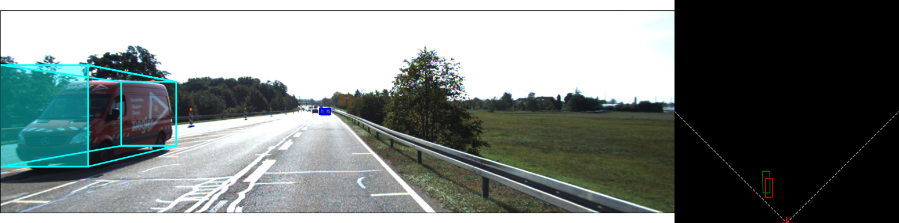

# creat env for YOLO3D
```shell
conda create -n Yolo3D python=3.8 numpy
conda activate Yolo3D
pip install -r requirements.txt
```

# datasets
## train data
```shell
cd yolo3d-lighting
ln -s /your/KITTI/path data/KITTI
```

```bash
├── data
│   └── KITTI
│       ├── calib
│       ├── images_2
│       └── labels_2
```

# Demo
<div align="center">

</div>

# train
```shell
python src/train.py experiment=sample
```
> log path:    /logs  \
> model path:  /weights

# covert
modify [convert.yaml](configs/convert.yaml) file to trans .ckpt to .pt model
```shell
python covert.py
```

# inference
In order to show the real model infer ability, we crop image according to gt 2d box as yolo3d input, you can use following command to plot 3d result.

modify [inference.yaml](configs/inference.yaml) file to change configs

```shell
python inference.py \
          source_dir=./data/KITTI \
          detector.classes=6 \
          regressor_weights=./weights/pytorch-kitti.pt \
          export_onnx=False \
          func=image
```

- source_dir:             path os datasets, include /image_2 and /label_2 folder                    
- detector.classes:       kitti class
- regressor_weights:      your model
- export_onnx:            export onnx model for apollo

> result path: /outputs

# evaluate
generate label for 3d result:
```shell
python inference.py \
          source_dir=./data/KITTI \
          detector.classes=6 \
          regressor_weights=./weights/pytorch-kitti.pt \
          export_onnx=False \
          func=label
```
> result path: /data/KITTI/result

```bash
├── data
│   └── KITTI
│       ├── calib
│       ├── images_2
│       ├── labels_2
│       └── result
```

use kitti evaluate tool to calculate mAP:
```shell
python evaluate.py \
          gt_dir=./data/KITTI/label_2 \
          pred_dir=./data/KITTI/result
```

- gt_dir:        gt labels folder                    
- pred_dir:      model output result labels

--------------

<!-- 更改 assets/global_calib.txt 内参矩阵 -->
python evaluate.py \
  detector.model_path=./weights/detector_yolov5s.pt \
  regressor_weights=./weights/regressor_resnet18.pt


# case:

case1:
AttributeError: ‘Upsample‘ object has no attribute ‘recompute_scale_factor‘
[https://blog.csdn.net/Thebest_jack/article/details/124723687]

case2:
cv2.error: Caught error in DataLoader worker process 1
[https://github.com/ultralytics/yolov3/issues/1721]